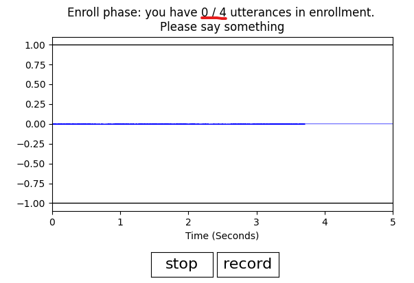
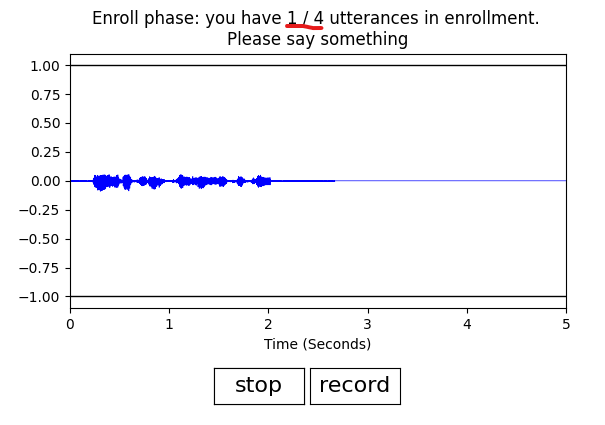
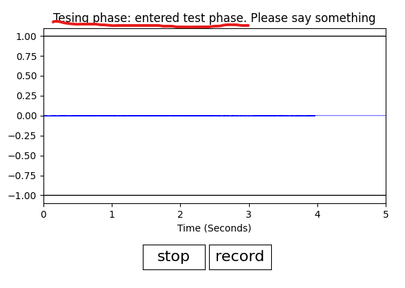
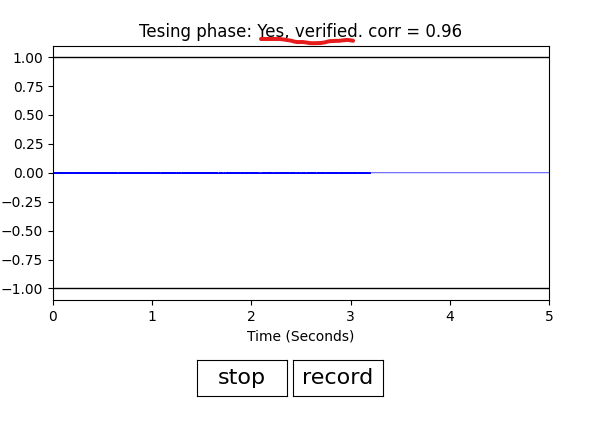
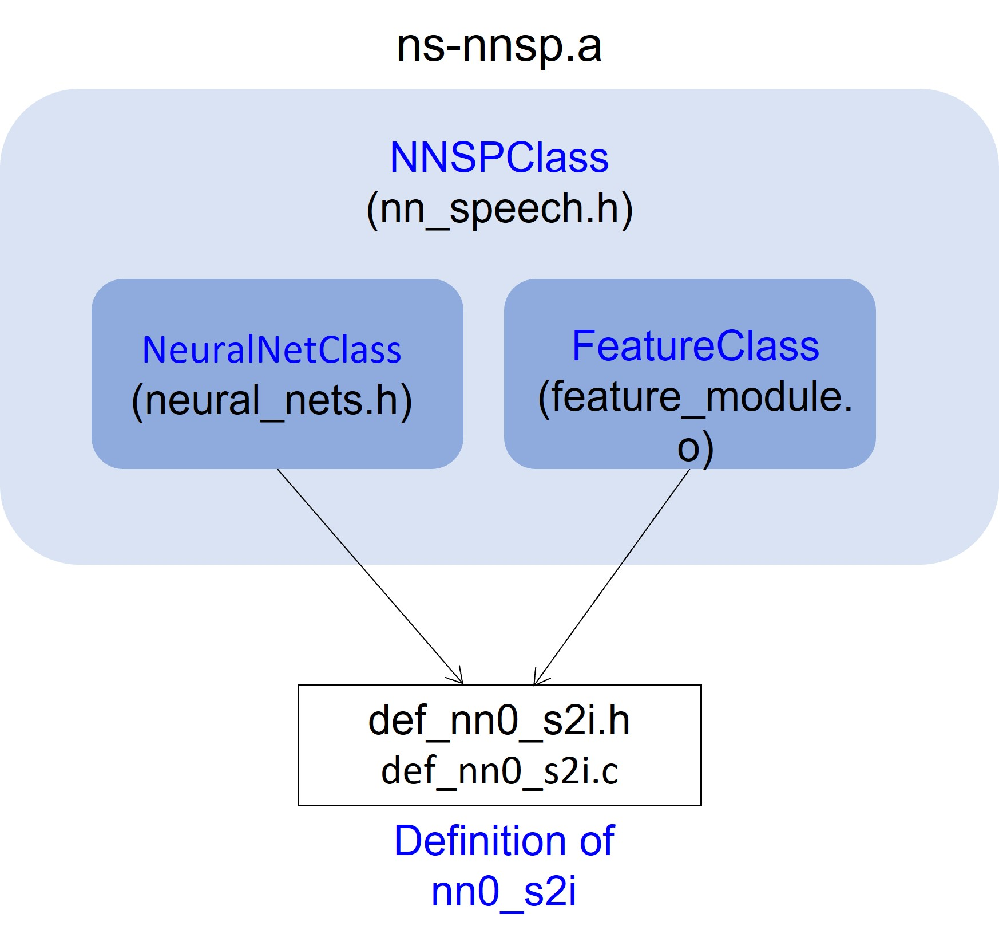

# NN Identification
NN Speaker ID (NNID) is a speaker identification/verification model based on recurrent neural networks (RNN).
## Directory contents
```py
nnid/ # root 
    evb/ # for evb deployment
        build/      # bin files
        includes/   # required inlcudes
        libs/       # required libs
        make/       # make.mk
        pack/
        src/        # c source codes
        Makfile
        autogen.mk
    ns-nnsp/  # c codes to build nnsp library (used only when re-building library)
    python/   # for NN training
    README.md # this readme
```
## Prerequisite
### `Software`
To work on Apollo4, you need
- Arm GNU Toolchain 11.3
- Segger J-Link v7.56+
# Speaker Identification
This speaker identification model is based on 16kHZ sampling rate. The model size is about 110kB. Also, there is one extra VAD (voice activity detection) model to extract the voice data. The extracted data is then sent to the speaker identification mode for verfication.

### `Dataset`
The NNID model is trained based on several audio dataset, including human speech and noises. Before you use this repo, please read on their license agreements carefully in [here](./docs/README.md).

## Compiling and Running a Pre-Trained Model
From the `nnid/evb/` directory:

1. `make clean`
2. `make`
3. `make deploy` Prepare two USB cables. Ensure your board is connected via both the `JLINK USB port` and the `audio USB port`. Then turn on the power on EVB.
4. Plug a mic into the 3.5mm port, and push BTN0 to initiate voice recording
5. `make view` will provide SWO output as the device is running.
6. On your cmd, type
   ```cmd
   $ python ../python/tools/audioview_nnid.py --tty=/dev/tty.usbmodem1234561
   ```
   You should see a GUI popping out.
   You might need to change the option `--tty` depending on your OS.
7. On your GUI, prress `record` to start recording to enter the `enrollment phase`. 
    * The GUI will show you have `0/4` utterances in enrollment as shown in `Fig. 1.1`. The `0/4` means there will be total 4 utterances to be record, and there is 0 utterance recorded now.
    * You can start to say something. Try to make your uterance last around 2 seconds. If your speech is detected, the GUI will show you have `1/4` utterances in enrollment as shown in `Fig. 1.2`. This means you'd successfully enrolled the first utterances. Keep say something and repeat the process until all 4 utterances are enrolled.
    * After all 4 utterances are enrolled, GUI will show you are in the `testing phase` in `Fig. 1.3`.
    * In the `testing phase`, try to say something and try to make your utterance last around 2 seconds. If your voice is verified, GUI will show `Yes, verified` in `Fig. 1.4`. Conversely, if your voice is not verified, GUI will show `No, not verified` on the top of GUI.
    * You can repeat testing (try to say something again to seee whether your voice is verified)
     If you want to stop the program, just press the `stop` button.
    * Check the two recording files under `nnid/evb/audio_result/`. 
      - `audio_raw.wav`: the raw PCM data from your mic.
      - `audio_debug.wav`: the debug infomation.
    * You can restart the program by pressing `record` button. You will enter the `enrollment phase` again. 
<p align="center">
  
</p>
<p align="center">
  Fig. 1.1: GUI shows the enrollment phase, and `0` utterances is enrolled
</p>
    
<p align="center">
  
</p>
<p align="center">
  Fig. 1.2: GUI shows the enrollment phase, and `1` utterances is enrolled
</p>

<p align="center">
  
</p>
<p align="center">
  Fig. 1.3: GUI shows the you are entering testing phase.
</p>

<p align="center">
  
</p>
<p align="center">
  Fig. 1.4: in the testing phase, try to say something and try to make your utterance last around 2 seconds. If your voice is verified, GUI will show `Yes, verified`.
</p>

## Re-Training a New Model

Our approach to training the model can be found in [README.md](./python/README.md). The trained model is saved in [evb/src/def_nn4_nnid.c](evb/src/def_nn4_nnid.c) and [evb/src/def_nn4_nnid.h](evb/src/def_nn4_nnid.h). 

## Library NS-NNSP Library Overview
Library neuralspot NNSP, `ns-nnsp.a`, is a C library to build a pipeline including feature extraction and neural network to run on Apollo4. The source code is under the folder `ns-nnsp/`. You can modify or rebuild it via [NeuralSPOT Ambiq's AI Enablement Library](https://github.com/AmbiqAI/neuralSPOT).
In brief, there are two basic building blocks inside `ns-nnsp.a`, feature extraction and neural network. In `ns-nnsp.a`, we call them `FeatureClass` defined in `feature_module.h` and `NeuralNetClass` in `neural_nets.h`, respectively. Furthermore, `NNSPClass` in `nn_speech.h` encapsulates them to form a concrete instance.
We illustrate this in Fig. 1. 
<p align="center">
  
</p>
<p align="center">
  Fig. 1: Illustration of `ns-nnsp`
</p>

Also, in our specific s2i NN case, `def_nn0_s2i.c` has two purposes:
  1. For feature extraction, we use Mel spectrogram with 40 Mel-scale. To apply the standarization to the features in training dataset, it requires statistical mean and standard deviation, which is defined in `def_nn0_s2i.c`. 
  2. For the neural network, it points to the trained weight table defined in `def_nn0_s2i.c` as well.


# Build NS-NNSP library from NeuralSPOT (Optional)
If you want to modify or re-build the `ns-nnsp.a` library, you can follow the steps here. 
1. Download NeuralSPOT
```bash
$ git clone https://github.com/AmbiqAI/neuralSPOT.git ../neuralSPOT
```
2. Copy the source code of NS-NNSP to NeuralSPOT. Then go to NeuralSPOT folder.
```bash
$ cp -a ns-nnsp ../neuralSPOT/neuralspot; cd ../neuralSPOT
```
3. Open `neuralSPOT/Makefile` and append the `ns-nnsp` to the library modules as below
```bash
# NeuralSPOT Library Modules
modules      := neuralspot/ns-harness 
modules      += neuralspot/ns-peripherals 
modules      += neuralspot/ns-ipc
modules      += neuralspot/ns-audio
modules      += neuralspot/ns-usb
modules      += neuralspot/ns-utils
modules      += neuralspot/ns-rpc
modules      += neuralspot/ns-i2c
modules      += neuralspot/ns-nnsp # <---add this line

# External Component Modules
modules      += extern/AmbiqSuite/$(AS_VERSION)
modules      += extern/tensorflow/$(TF_VERSION)
modules      += extern/SEGGER_RTT/$(SR_VERSION)
modules      += extern/erpc/$(ERPC_VERSION)
```
4. Compile
```bash
$ make clean; make; make nest
```
5. Copy the necessary folders back to `nnid` folder
```bash
$ cd nest; cp -a pack includes libs ../nnid/evb
```