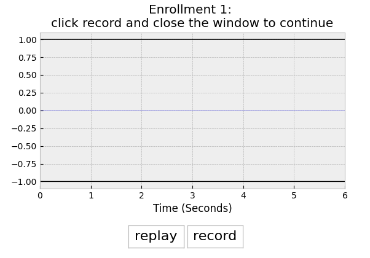

# Neural net identification (NNID) model
This document explains how to train speaker identification (speaker verfication) by using recurrent neural network. Specially, we use the `text-independent` model as an example since it is free and can be easily acquired.
## Prerequisite
Note that all python scripts described here are all under the folder `nnid/python`
- Python 3.7+
- (optional but recommended) Create a python [virtualenv](https://docs.python.org/3/library/venv.html) and install python dependencies into it:
  - Linux
    ```
    python3 -m venv .venv
    source .venv/bin/activate
    pip install -r requirements.txt
    # call other python tasks defined below with this active
    # then when finished with this virtualenv type:
    deactivate
    ```
  - Windows: in command window, type
    ```cmd
    python -m venv .venv
    .venv/Scripts/activate.bat
    pip install -r requirements.txt
    # call other python tasks defined below with this active
    # then when finished with this virtualenv type:
    deactivate
    ```
## Dataset
Before working on training NNID model, we need to download the required datasets. Please read on their license agreements carefully in [here](../docs/README.md).
## Quick start
We provide an already trained model in this repo. The user can directly try on it. The model size is around `~110k` parameters. \
To execute the test, type the command
```cmd
  $ python test_nnid.py --epoch_loaded=80 --nn_arch='nn_arch/def_id_nn_arch100_ti.txt' --speaker='Tom' 
```
`Input argruments`:
  * `--nn_arch`: it will load the definition of NN architecture in `nn_arch/def_id_nn_arch100_ti.txt`. 
  * `--epoch_loaded`: it will load the model saved in epoch = 80.
  * `--speaker`: input your name. In this case, speaker is `Tom`

After execution, a GUI will pop out to ask you to do following processes
  * `enrollment phase` : you are asked to enroll 3 sentences. Click `record` button to start your recording for 6 seconds (see Fig. 1). Try to say anything to fill up this duration. After recording is finished, you can record it again if you are not satisfied. Or you can close the window and go to next recording. Repeat the processes 3 times to finish the enrollment. After enrollment, it will automatically generate your own embeding vector, which will compare to the testing vector once you pronounce. \
   `Note` : only one the enrollment (to record 3 sentences) is required in the testing. However, you are free to enroll again. 
 * `Testing phase` : after embeding vector is generated, a GUI will pop up to record your test vector. Similar to enrollment, click `record` to recording your test
vector. The NN model will compare this test vector to your own embedding vector. If it was matched, it will show in the command window. Also, it will compare two other speakers' pronounciations. It should not match to these pronounciations.
<p align="center">
  
</p>
<p align="center">
Fig. 1: A GUI interface for speaker verification enrollment. In the title it shows enrollment 1. This means this is the first enrollment. Click `record` button to start the recording. After recording, you can replay, record again or close the window to finish this enrollment. You have to enroll 3 sentences in total.
</p>
  

## Training procedure
### `Data generation phase`
To generate the training data (features and targets), type
```cmd
$ python data_nnid_ti.py --download=1
```
Arguments:
  * download:
    * 1 : This option will download the data
    * 0 : This option will not download the data
### `Training phase`
To train the NNID model, type
```cmd
$ python train_nnid.py --nn_arch='nn_arch/def_id_nn_arch100_ti.txt' --epoch_loaded=`random` --learning_rate=4 * 10**-4
```
Arguments:
  * nn_arch : the definition of neural net (NN) architecture. In this case, the architecture is defined in [here](nn_arch/def_id_nn_arch100_ti.txt)
  * epoch_loaded : 
    * 'random' : random initialization of the weight table
    * 'latest' : the latest weight table which was already trained epoch
    * 80       : epoch 80 in this example. You can also put any the number of epoch (integer) that was trained
  * learning_rate : the learning rate, which is 4*10**-4 in this example
### `Testing phase`
See the `Quick start` section
# Convert TF-model to C table
To run the model on the embedded system, Apollo4 in our cae, we need a tool to support
1. A neural network architecture, equivalent to Tensorflow, to perform on the desired microcontroller,
2. A converter to convert the set of weight tables trained by Tensorflow to save on the memory of the microcontroller. One of the common format to save weight table would be `8-bit` integer, and this is what we adopted as well. 

For example, [TFLM](https://www.tensorflow.org/lite/microcontrollers) (tensorflow lite for microcontroller) supports two functionalities.

In Tensorflow NN training, we usually use `32-bit floating` point format (or even higher precision such as biases)  to save the weight table or activations. However, it is not very friendly for microcontroller due to the limitation of memory size and computational power. To overcome this shortage, one of the most common format is to quantize them to the lower precision scheme, such as `8-bit integer`. However, this might degrade the performance due to the simple compression scheme. The [quantization aware training](https://www.tensorflow.org/model_optimization/guide/quantization/training) is advised to mitigate the degradation. 

Furthermore, as mentioned in [TFLM Post-training integer quantization with int16 activations](https://www.tensorflow.org/lite/performance/post_training_integer_quant_16x8), by making activations to `16-bit` integer values, while keeping weight table as 8-bit integer, this can improve accuracy of the quantized model significantly, compared to the `8-bit` integer activation case. Tensorflow refers to this mode as the `16x8 quantization mode`. However, as we tried the `16x8 quantization mode` on Apollo4, it does not work. The reason might be that `16x8 quantization mode` is still in the experimental stage.  

To resolve this deficiency, 
1. we provide the C library, `ns-nnsp.a` under the folder `../evb/libs/`, to support the neural network with activations in `16-bit` values while keep the weight table in 8-bit integer values.
2. we provide a converter, [c_code_table_converter.py](./c_code_table_converter.py), to quantize the weight table in 8-bit integer format and convert it to C format so that `ns-nnsp.a` can call for. 
## C table conversion
 To convert the trained model by Tensorflow to C table, type:
```cmd
  $ python c_code_table_converter.py --epoch_loaded=62 --nn_arch='nn_arch/def_se_nn_arch72_mel.txt' --net_id=3 --net_name='se'
```
  * Here we provide an already trained model. Its nn architecture is defined in `nn_arch/def_se_nn_arch72_mel.txt`. You can change to your own model later.
  * The argument `--s2i_nn_arch='nn_arch/def_se_nn_arch72_mel.txt'` will load the definition of NN architecture in `nn_arch/def_se_nn_arch72_mel.txt`. 
  * The argument `--epoch_loaded=62` means it will load the model saved in epoch = 800.
  * The argument `--net_name='se'` provides the this neural net a specific name. This is very important if you use sevearal NNs.Ensure that you only assign each NN one and only one `net_name`.
  * The argument `--net_id=3` provides the NN an identification. Ensure that you only assign each NN one and only one `net_id`.
  
  After execute `c_code_table_converter.py`, you can see that it generates two files as below
  ```cmd
../evb/src/def_nn3_se.h
../evb/src/def_nn3_se.c
  ```
Note that the header (\*.h) and the source file (\*.c) follow the rules below 
```c
def_nn{net_id}_{net_name}.h and
def_nn{net_id}_{net_name}.c
```
The `def_nn3_se.c` saves the set of weight tables and its NN architecture in this neural net, called `nn3_se` here.

# Deploy to Apollo4
See [README.md](../README.md) here.